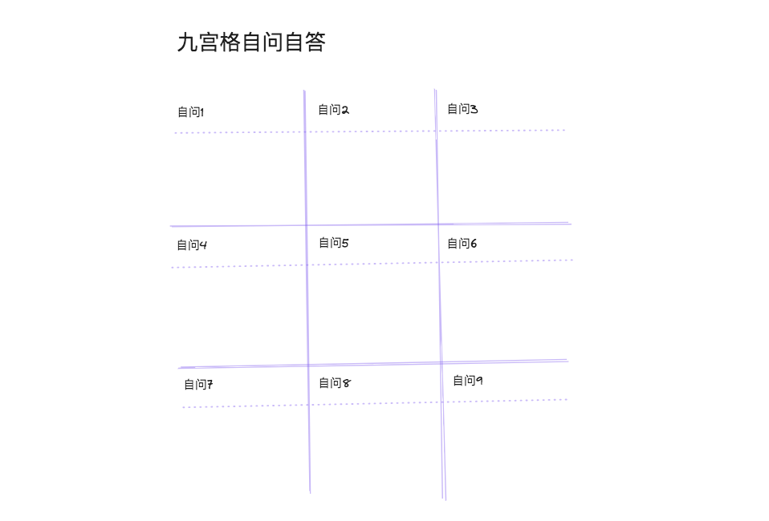
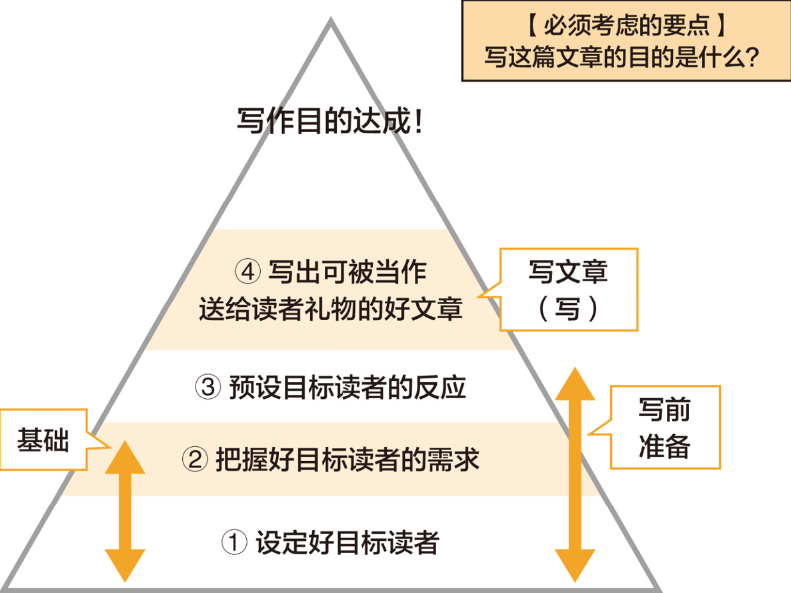

# 读《九宫格写作法：如何写出一篇好文章》

> 此书作者山口拓朗先生，是亚洲顶尖文案撰稿人，日本百万级畅销书作家，专注研究写作24年。 山口先生自己写的书，总共50多本了吧。 他觉得写作是一种道行，我们可以通过打磨文章打磨人的品行。

不杠精的讲，了解的一些日本人干一件事持续干几十年，专注力是真的很强，很让人钦佩。

我想捡起自己的写作，虽然工作中也经常写，但总感觉自己写的那不算文章，顶多算是说明文书，很难让人读起来感觉到才气，有收获就算不错的了。我想通过写作，丰富自己的能力、丰富自己的生活，同时记录下生活历程中的一个个点，未来的某天往前看，也可以聊以自慰，“哦，我也不算什么都没留下的”。

写作，就是写出自己心里的想法，我们如果太在意别人的目光，是很难写出好文章的，不要想着展现完美的自己，真正对我们重要的是动起来、写出来、发表，只要文章表达了自己的观点和感受就不虚此文。我们永远不能同时满足所有人，我们表达的只是一种观点，能为一部分人发出声音，这就足够了。所以，直面自己的观点和感受，为自己负责，真诚才能让你的文章更有风味。

> 写出来比什么都重要！大胆的表达自己的观点，没有个性的文章是“毫无价值”的
> 
> 别一心想着与众不同，阳光之下没有新鲜事
> 
> 不要害怕被否定、被批判，做一个心理强大的人，接受批评，有则改之无则加勉。
> 
> 想影响别人，脸皮得厚，写作就像销售，没有热脸贴冷屁股的决心，怎么有动力持续下去呢

正向循环：`表达自己真实的意见与观点 -> 帮助到别人 -> 收获自信 -> 精神焕发 -> 文字蕴含力量 -> 更易引发共鸣 -> 吸引更多的相同价值观的读者`

何为好文章呢？

- 兼备“信息”和“感受”
  - 只有“信息”，就是毫无感情的说明文。空有“感受”，让人觉得错愕，别人不知道这是干了什么事情。
- 达成目的的文章

怎么写出好文章？
- 预则立不预则废，提前规划，做好准备
  - 想写好一篇游记，就需要在游玩之前思考需要关注哪些方面，留心记录这些方面的素材
- 收集素材，内部信息与外部信息
  - 内部信息：自我剖析得来，想法、情感、发现、感觉、意见、主张、体验、价值观、信念
    - 对自己进行采访式的`“自问自答”`有助于更好地表达出自己的感受
  - 外部信息：来自外界，如媒体信息、场地信息（现场，五官感受）、他人的信息、研究、实验、调查结果
- 热情写作，冷静修改
  - 删除可有可无的信息
  - 理顺文章章节
  - “冷静”修改时最好保持“删除多余信息：补充不足信息=7：3”的意识，这是一个黄金比例

写作的三个步骤
1. 自问自答（准确 & 具体）
2. 整理收集的信息（内部、外部）
3. 组织文章，冷静修改，雕琢打磨

> 写作类比烹饪
> 
> 想象下我们烹饪美食时会做什么动作？一般会先查看下菜谱，浏览下步骤，此时我们一般手上有主材，可能还需要一些辅材，总之是要备齐食材的，然后开始烹饪，之后摆盘上桌，等待家人的品鉴夸奖。
>
> 哈哈哈，是不是二者像极了呢？写了文章是不是也希望别人一键三连呢？

九宫格是一个结构化的技巧，让我们把写作主题拆成一些更细粒度的关键点，我们可能对于整体比较混沌，对于细粒度的一些点我们却是容易把握和搜集信息的，这样的话我们就方便整理写作的素材，有了足够的素材，我们组织起一篇主题文也就剩下信息的调度与衔接处理。

写作流程就简化成：`“收集信息” => “整理信息” => “编写文章”`，是不是看着也没那么的难了呢？

**九宫格自问自答法**，用来收集优质的写作素材。简单说就是制作一个含有9个单元格的表格，然后在每个单元格内分别填入一个问题，并进行回答。在“设定问题—思考答案”的过程中收集写作素材。不必一次写出全部问题，按顺序慢慢推进即可。

|九|宫|格|
|--|--|--|
|自问1|自问2|自问3|
|自问4|自问5|自问6|
|自问7|自问8|自问9|

为什么是9宫呢？这个我觉得不是必须的，按作者所言，9宫即不多也不少，信息量刚刚好。

问题一般分为两类：`基础问题` 和 `铲子问题`
- 基础问题引出客观事实，单纯提供信息
- 铲子问题将话题往深处扩展，

尽可能将问题具体化，具体问题得到具体的回答，深入话题后获得有趣的素材的几率才更大。如果笼统的问问题，得到的往往是笼统简略含混的回答，话题很难深入下去。可见，提供的水平决定了答案的品质。

怎么提出有价值的问题呢？

> 7W3H
>
> Who 由谁？负责、分担、主体
>
> What 何物？目的、目标、内容
>
> When 何时？期限、时期、日程、时间
>
> Where 何地？场所、目的地
>
> Why 为什么？理由、依据
>
> Whom 对谁？对象
>
> Which 哪一个？选择
>
> How 如何做？方法、手段
>
> How many 多少（数量）
>
> How much 多少钱

提问题，主要在于多问几个为什么，连续的问，带上下文的问，case by case

提问题、解答问题，如果能提供一些方法和手段，也就是how，将能提升文章的价值，让读者更有获得感，也能根据提供的方法自行实践，这样更能同作者感同身受。

举个例子：`最近有什么高兴的事？` -> `两周减掉两公斤` -> `用什么方法减的啊？` -> `早中晚只喝汤，少吃米饭和炒菜`

**九宫格信息收集法** 搭建接收信息的天线

人的大脑只会读取“自己在意的信息”，所以即便大家在同样的地方看着同样的风景，每个人所获得的信息也会全然不同。

> - 脑科学：网状活化系统（RAS）—— 脑干腹侧中心部分神经细胞和神经纤维相混杂的结构。网状结构是脑部的一个区域，位于脑干的神经元网络，专门控制睡眠和清醒。网状结构高度活化时，造成清醒，反之则陷入沉睡。
> 
> - 心理学：色彩浴（colorbath）效应 —— 基于自己所想的内容，带有倾向性地收集相关信息。

如何应用呢？首先在正中央的单元格内填入标题，然后在周围的8个单元格内分别填入与标题相关的主题。

以送人礼物的心态对待自己写出的文章，以对方为中心而不是以作者为中心，选择适合对方的礼物，对方在收到礼物时才会觉得开心，如果是对方不需要的礼物，可能对方会觉得负担更多一点。

- 目标对象是谁？目标人群、目标读者，精准定位
- 如何引起对方兴趣
- 文章对对方有什么好处
- 预先设定读者的理想反应
- 把握读者需求，在烦恼什么、想要什么

提升语法和词汇水平
- 一文一义：一句话（以句号结尾的句子）只写一个信息。句子里的信息越少，大脑需要处理的信息量也就越少，于是就能提高读者对句子的理解。

- 拉近主语和谓语的距离
- 不用多余的表达和措辞
- 要尽可能写得具体

九宫格近义词转换游戏

“比如”游戏，发散，举例子，具体化

“也就是”游戏，抽象，提升

“指路”游戏，提高逻辑说明能力

PDCA循环

①计划（Plan）→ ②执行（Do）→ ③检查（Check）→ ④改善（Act）

Plan：明确写作目的

Do：写文章

Check：验证是否达成写作目的

Act：为了下次能达成目的而作出调整

每天写下3个好消息！树立积极的意识，养成收集好消息的习惯。自我启发的技巧里最有名且最有效的就是“思考现实化”。

未来简介：未来简介里要写的应该是5年后理想的你。假设现在你来到了5年后，请在脑海中想象出自己最理想的样子。不要设任何限制，包括金钱、场所、人、资质等。不要想太多，不用害羞和客气。（做个白日梦，狠劲的做，自由畅想自由梦）

说到写未来简介，这里有两个关键，一个是“设想自己就是理想中的那个人”，另一个是“要写得具体”。

为了让其效果最大化，请每天大声朗读你所写的内容，并将它放置在目之所及的地方。