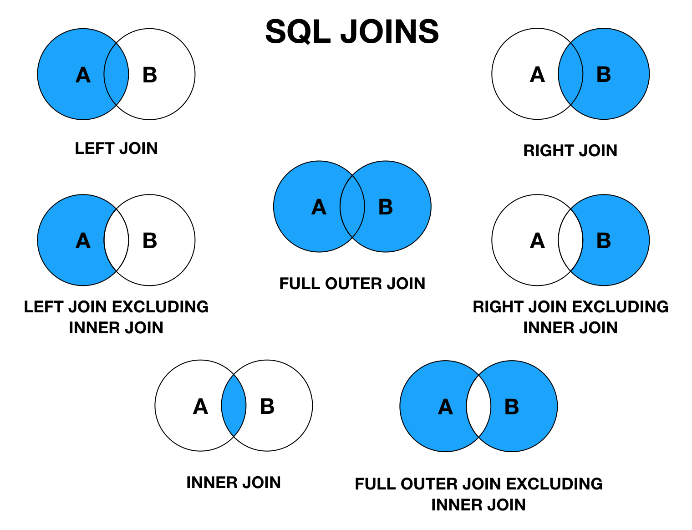

# week 11

## 效应

- 乌比岗湖效应
- 杜宁·克鲁格效应
- 逆火效应
- 飞轮效应
- 口碑效应

## 原理

[PDF Explained](https://zxyle.github.io/PDF-Explained/)

《PDF 解析》

这是对广泛使用的可移植文档格式的平易近人的介绍。 PDF无处不在，无论是在线形式还是印刷形式，但很少有人利用这些有用的功能或掌握这种格式的细微差别。 这本简明的书籍为程序员，高级用户提供了世界领先的页面描述语言(pdf)的动手实践。以及搜索，电子出版和印刷行业的专业人士， 有大量示例，本书是你完全理解PDF所需的文档。

## 技术文章类网站

[CSS-TRICKS](https://css-tricks.com/)

[dev.to](https://dev.to/)

## 工具

[alltomp3](https://alltomp3.org/)

[hoppscotch.io](https://hoppscotch.io/)
postman 替代品，github地址 [hoppscotch](https://github.com/hoppscotch/hoppscotch)

[InfoSpider](https://github.com/kangvcar/InfoSpider)
一个神奇的工具箱，拿回你的个人信息。

[屏幕动作录制-自动化](https://github.com/checkly/headless-recorder)
Chrome extension that records your browser interactions and generates a Playwright or Puppeteer script.【archived】

[markdown-nice](https://editor.mdnice.com/) markdown行文，转成各平台文章格式，复制去发布，支持换主题

[excalidraw](https://excalidraw.com/) 绘图工具

## 写代码片段

[codepen](https://codepen.io/)

## JavaScript

[antd Select onChange获取除了value其他的值](https://blog.csdn.net/weixin_41718879/article/details/120343083)
给 option 标签添加“data”属性；

[Simulating Object Collisions With Canvas](https://joshbradley.me/object-collisions-with-canvas/)

## CSS

[Suzanne Aitchison @aitchiss](https://codepen.io/aitchiss/collections/)

[Image manipulation with CSS](https://dev.to/ziizium/image-manipulation-with-css-11dd)

[disable css in browsers](https://github.com/keithclark/css-feature-toggle-devtools-extension)
This devtools extension provides the ability to toggle-off CSS features, allowing developers to see how their pages and applications render and fallback in browsers that don't support modern CSS features.

[UnoCSS](https://unocss.dev/)
UnoCSS 是一个即时、按需的原子级 CSS 引擎，旨在提供快速、高性能的原子级 CSS 解决方案。[UnoCSS Playground](https://unocss.dev/play/) | 文章 [重新构想原子化 CSS](https://antfu.me/posts/reimagine-atomic-css-zh)

[css-layout-hack.js](https://gist.github.com/vcastroi/e0d296171842e74ad7d4eef7daf15df6)

[UI调试技巧](https://mp.weixin.qq.com/s/gNmMOqVf-296BKIT39Lu2A)
添加 `html * { outline: '1px solid #f00' }` 页面所有元素都会显示轮廓线，便于查看元素的位置布局，不用border是因为border会增加元素的大小。

[filters-css](https://bansal.io/filters-css) CSS only library to apply color filters.

## Vue 生态

[vitesse](https://github.com/antfu/vitesse/tree/main)

## RAG

[Retrieval-Augmented Generation for Knowledge-Intensive NLP Tasks](https://ar5iv.labs.arxiv.org/html/2005.11401)

[arxiv 原文](https://arxiv.org/abs/2005.11401)

看论文的好地方

arXiv 是一个由志愿者作者、读者、版主、顾问委员会成员、支持成员、捐助者和第三方合作者组成的社区，并得到康奈尔大学员工的支持。

## JSON

[可视化json数据](https://apvarun.github.io/graphize/)

[JSON Schema Store](https://www.schemastore.org/json/)

## 音乐

[程序员音乐](https://musicforprogramming.net/latest/)

"Music For Programming" 是一个在线音乐播放平台，专门为编程时的听众提供音乐。该网站的宗旨是提供一系列的音轨，旨在促进程序员在编码时的专注和效率。音乐通常是选取的氛围音乐、环境音乐或是电子音乐，它们被认为有助于创造一个有利于专注工作的环境。

该网站为用户提供了一系列不同的音乐集（episodes），每个集都包含一个长音频轨，用户可以在编程时播放。音频通常都是免费的，并且可以直接从网站上流式播放或下载以供离线使用。

"Music For Programming" 的特点是，它不是普通的音乐流媒体服务如Spotify或Apple Music，而是专为创造编程工作氛围的特定用途而设计的。这种类型的音乐服务理解到，音乐可以作为一种生产力工具，帮助减少外界干扰，提高工作专注度。

[bongo.cat](https://bongo.cat/)
通过敲击键盘，弹奏不同乐器

[ZzFXM](https://keithclark.co.uk/articles/zzfxm/) 
ZzFXM is a tiny music generator and toolkit designed for size-limited JavaScript productions.
[keithclark](https://keithclark.co.uk/) 这是一个程序员的个人网站，里面有一些css的非凡应用，对css有兴趣的可以来此网站了解下。

## 日历&时间

[time.is](https://time.is/)

使用 Time.is，您可以：

- 查看全球逾七百万个地区的精确时间
- 检查您自己的时钟是否准确
- 比较各地时间

您还能查询：

- 日历
- 日出和日落时间
- 各地所处的时区
- 当天的节日和庆祝活动
- 经纬度
- 与 Time.is 整合的全屏 Google 地图
- 人口数量
- 世界各国的主要信息

Time.is 通过极小的带宽和适合小屏幕的设计提供了良好的移动设备浏览体验。

## 大佬

[Paul Graham 的文章](https://www.paulgraham.com/articles.html)

[李笑来](https://github.com/xiaolai)

[Anthony Fu](https://github.com/antfu)

[limboy](https://limboy.me/)

[catcoding](https://catcoding.me/)

[胡涂说](https://hutusi.com/links/)
这是他的友链，里面有很多推荐，由于太多了，不好直接贴这里，所以直接收藏了，慢慢看

[独钓寒江雪](https://king-hcj.github.io/links/)

## 书籍

[书Book](https://read.tianheg.org/)

## 文章

[中国大周期及其货币](https://finance.sina.com.cn/china/gncj/2020-09-21/doc-iivhvpwy8038347.shtml)
英文名：The Big Cycle of China and Its Currency | 
The Changing World Order系列

[微信互联网平民创业-李笑来](https://github.com/xiaolai/everyones-guide-for-starting-up-on-wechat-network)

[Attention is your scarcest resource](https://www.benkuhn.net/attention/)

[「划线高亮」和「插入笔记」](https://zhuanlan.zhihu.com/p/225773857)

[探索现代的移动网络](https://mp.weixin.qq.com/s/ds6QkVrBwcurxp3RkvZe8Q)
- IPV6
- HTTP/2
- TLS 1.3
- Multipath TCP
- 加密 DNS
- HTTP/3
- 本地网络隐私
- 受限网络中的推送连接

[改变世界的一次代码提交](https://hutusi.com/articles/the-greatest-git-commit)

[浏览器是如何工作的：Chrome V8让你更懂Javascript](https://king-hcj.github.io/2020/10/05/google-v8/)

[前端万字精华——浏览器简史及其核心原理详解](https://king-hcj.github.io/2021/07/11/web-browser/)

[如何无痛苦更新公众号](https://catcoding.me/p/publish-to-wechat/)

[关于licenses](https://creativecommons.org/licenses/by-nc-sa/3.0/)

`文章采用 BY-NC-SA 授权，如需转载请注明。`

## git

[图解Git工作原理](https://marklodato.github.io/visual-git-guide/index-zh-cn.html)

## github

[腾讯AlloyTeam](https://alloyteam.github.io/)

[prompt](https://github.com/yunwei37/Prompt-Engineering-Guide-zh-CN)
关于提示词工程（prompt）的指南、论文、讲座、笔记本和资源大全（自动持续更新）

## 站点生成

[docusaurus](https://docusaurus.io/)

Docusaurus 是 Facebook 专门为开源项目开发者提供的一款易于维护的静态网站创建工具，使用 Markdown 即可更新网站。构建一个带有主页、文档、API、帮助以及博客页面的静态网站，只需5分钟。

## 特效美化

[ztext](https://bennettfeely.com/ztext/)
Easy to implement, 3D typography for the web. Works with every font.
让文字有3D效果

## 数学

[CindyJS](https://cindyjs.org/)
CindyJS is a framework to create interactive (mathematical) content for the web.
CindyJS是一个为web创建交互式(数学)内容的框架。

## 颜色

[tailwindInk 调色板生成器](https://tailwind.ink/)

[日本传统色](https://colors.limboy.me/) 每天一种颜色，看见多彩生活

## Design

[Tencent ISUX](https://isux.tencent.com/articles/){:target='_blank'}

[example](https://king-hcj.github.io){:target='_blank'}

## 小游戏

[汉兜](https://handle.antfu.me/)
一天一个猜成语游戏，做的挺有意思的，好奇实现

[拼音猜成语](https://idiom.limboy.me/)

[wordle]()

## Java

[CodeGuide | 程序员编码指南](https://github.com/fuzhengwei/CodeGuide/wiki)

[Java内容大全](https://github.com/crisxuan/bestJavaer) 很全面的一个系列教程，包括计算机基础、操作系统、计算机网络

## SQL

[sql的各种join](https://king-hcj.github.io/2017/09/11/joins-in-sql/)

## markdown

[markdown奇技淫巧](https://king-hcj.github.io/2019/09/01/markdown-odd-skills/)

折叠块简介

我是折叠区内容～～～

使用 \ 标签来贴图，然后指定 align 属性。

图片居中可以使用 \
 标签加 align 属性来控制，图片宽高则用 width 和 height 来控制。

:smile:

**购物清单**

- [ ] 一次性水杯
- [x] 西瓜
- [ ] 豆浆
- [x] 可口可乐
- [ ] 小茗同学

[Markdown 常用技巧](https://www.zybuluo.com/songpfei/note/247346)  

---
- - -
***
代码块 tab实现

    hello world

## Emoji

[Emoji Cheat Sheet](https://www.webfx.com/tools/emoji-cheat-sheet/)